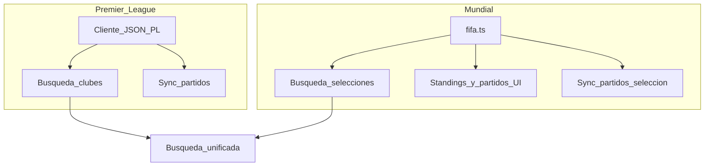

# Fuentes de datos: Premier League + Mundial (reemplazo de football-data.org)

Especificación para **dejar de depender de football-data.org** en el flujo de equipos seguidos, búsqueda de equipos y sincronización de partidos. El alcance del producto queda acotado a:

1. **Premier League** — clubes de la competición y sus partidos (dashboard, notificaciones, sync).
2. **Copa del Mundo** — selecciones y partidos del torneo, alineado con la API FIFA ya usada en la app.

No se contempla un catálogo global de todas las ligas y equipos (como el listado paginado actual de football-data).

**Relación con otros docs:** El estado actual de integración con football-data.org sigue descrito en [specs/SPECS.md](../SPECS.md) (sección de APIs externas y cron). Este documento define el **estado objetivo** tras la migración.

---

## Objetivos

- Eliminar `FOOTBALL_DATA_API_KEY` y el cliente en [`src/lib/football-data.ts`](../../src/lib/football-data.ts) del camino crítico de búsqueda y sync.
- **Premier League:** consumir datos de forma estable, preferentemente **JSON** (patrón similar a [`src/lib/fifa.ts`](../../src/lib/fifa.ts)), no scraping de HTML de páginas tipo matchweek.
- **Mundial:** centralizar búsqueda de selecciones y, donde aplique, el calendario de partidos para equipos seguidos en la **API FIFA** (`https://api.fifa.com/api/v3`), extendiendo lo necesario sobre el código existente.

## No objetivos (por ahora)

- Cubrir ligas fuera de la Premier ni selecciones fuera del contexto Mundial en este mismo producto.
- Depender de parseo frágil del DOM de [premierleague.com](https://www.premierleague.com) como fuente principal.

---

## Principios de implementación

| Patrón | Descripción |
|--------|-------------|
| API JSON | Igual que FIFA: HTTP + JSON documentado o descubierto (tab Network), no HTML renderizado. |
| Spike PL | Inventariar endpoints que usa `premierleague.com` (autenticación, rate limits, IDs de club y de partido). |
| Extensión FIFA | Reutilizar `fetchRawWCMatches`, standings, etc.; añadir solo lo necesario para búsqueda WC y sync por selección. |

---

## Arquitectura objetivo

- **Mundial:** listado de selecciones y calendario vía FIFA; no usar `searchTeams` de football-data para WC.
- **Premier:** nuevo módulo cliente tras el spike (URLs, headers, límites).

---

## Búsqueda unificada de equipos

**Ruta actual:** [`src/app/api/teams/search/route.ts`](../../src/app/api/teams/search/route.ts) usa `searchTeams` de football-data (catálogo global).

**Objetivo:**

- Para la query `q`, combinar resultados de:
  - la fuente **Premier League** (clubes de la competición), y
  - la fuente **Mundial** (selecciones participantes o expuestas por la API FIFA / lista derivada).
- Los ítems pueden llevar etiqueta de ámbito, p. ej. `kind: "pl" | "wc"`, para que la UI o el guardado de `followed_teams` distingan el tipo de `teamKey`.

## Identificadores de equipo (`team_key` / `teams.api_id`)

Hoy `team_key` y `teams.api_id` reflejan IDs numéricos de football-data (p. ej. Chelsea `61`, Argentina `762`).

Objetivo: un esquema que no asuma solo esos IDs, por ejemplo:

- IDs con prefijo o namespace (`pl:…`, `fifa:…`), o
- columna `provider` + id externo, según migración elegida.

Cualquier cambio debe coordinarse con [`src/server/db/schema.ts`](../../src/server/db/schema.ts), seed y [`src/server/db/queries.ts`](../../src/server/db/queries.ts).

---

## Sincronización de partidos (crons y settings)

**Archivos afectados:**

- [`src/app/api/cron/daily/route.ts`](../../src/app/api/cron/daily/route.ts)
- [`src/app/api/cron/sync-matches/route.ts`](../../src/app/api/cron/sync-matches/route.ts)
- [`src/app/actions/sync-fixtures.ts`](../../src/app/actions/sync-fixtures.ts)
- [`src/app/(app)/settings/actions.ts`](../../src/app/(app)/settings/actions.ts)

**Comportamiento objetivo:**

| Tipo de equipo seguido | Fuente de fixtures |
|------------------------|--------------------|
| Club PL | Cliente JSON Premier (equivalente a `fetchUpcomingFixtures` por id de club estable). |
| Selección (Mundial) | Calendario FIFA: filtrado por equipo si el API lo permite; si no, filtrar en servidor sobre los partidos ya obtenidos (p. ej. `fetchRawWCMatches` en `fifa.ts`) por nombre/código de selección. |

La cron debe poder **ramificar** según el tipo de `teamKey` (o según metadata del equipo en `teams`).

---

## Modelo de datos: partidos (`matches`)

Hoy `api_football_id` es entero único y corresponde al ID de partido de football-data.

Con dos proveedores (PL + FIFA):

- Evitar colisiones: usar **ID compuesto en texto** (`pl:…`, `fifa:…`) **o** migrar a `external_match_id` (texto) + `provider`, con índice único compuesto.
- Actualizar [`upsertMatch`](../../src/server/db/queries.ts) y notificaciones que dependan de unicidad por partido externo.

---

## Limpieza y configuración

- Tras la migración: reducir o eliminar [`src/lib/football-data.ts`](../../src/lib/football-data.ts) (`getAllTeams`, `fetchWorldCupMatches` hacia football-data, etc.).
- [`next.config.mjs`](../../next.config.mjs): actualizar `images.remotePatterns` si deja de usarse `crests.football-data.org`.
- [`.env.example`](../../.env.example), README, seed ([`src/server/db/seed.ts`](../../src/server/db/seed.ts)): nuevas variables (si las hay), URLs de escudos y ejemplos de `teamKey`.

---

## Checklist de implementación (referencia)

1. Spike: endpoints JSON Premier League (Network tab, IDs, auth).
2. Definir búsqueda de selecciones WC y sync desde `fifa.ts` sin football-data.
3. Diseñar migración de IDs (`api_football_id` / `team_key`).
4. Implementar clientes + búsqueda unificada + reemplazo en crons y settings.
5. Docs y env; retirar `FOOTBALL_DATA_API_KEY` cuando no se use.

---

## Referencias de código

| Componente | Ubicación |
|------------|-----------|
| Cliente FIFA (Mundial) | `src/lib/fifa.ts` |
| Cliente football-data (legacy) | `src/lib/football-data.ts` |
| Búsqueda equipos | `src/app/api/teams/search/route.ts` |
| Schema DB | `src/server/db/schema.ts` |
| Upsert partidos | `src/server/db/queries.ts` |
