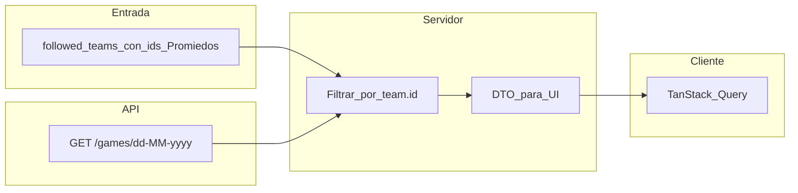

# Fuentes de datos: Promiedos (`promiedos.ts`)

Especificación para **consumir partidos y metadatos de equipos desde la API JSON que usa el sitio [promiedos.com.ar](https://www.promiedos.com.ar)** (no es una API pública documentada, pero el front Next.js la llama con `fetch` y devuelve JSON).

**Relación con otros docs:**

- [Opción 1 (Premier + FIFA)](../option-1/SPECS.md): fuentes oficiales / contrato estable por competencia.
- Esta opción prioriza **amplitud de datos y modelo centrado en “equipos que sigo”**, no en acotar el producto a dos competencias.

---

## Objetivos

- Introducir un módulo cliente `[src/lib/promiedos.ts](../../../src/lib/promiedos.ts)` que centralice HTTP, headers y tipos mínimos.
- **Obtener fixtures por equipos seguidos** (sin espejo obligatorio en DB para la UI): conocer el **identificador Promiedos del equipo** (`id` + `url_name`) y **filtrar** partidos de respuestas por fecha. El dashboard y el detalle de próximos partidos usan **fetch on-demand** + caché (TanStack Query); ver [fixtures-dashboard-cron](../../fixtures-dashboard-cron/SPECS.md).
- Permitir **búsqueda / alta de equipos** alineada con Promiedos (listados por liga vía SSR del sitio o índices derivados), de forma que `team_key` en DB referencie un id estable en ese ecosistema.

## No objetivos (inicial)

- Reemplazar por completo el módulo Mundial / prode si ya dependen de la API FIFA; valorar **convivencia** (Mundial en FIFA, clubes vía Promiedos) o un spike aparte.
- Garantizar SLA legal: el uso es el mismo que el navegador; revisar términos del sitio y volumen de requests.

---

## Hallazgos técnicos (spike Abril 2026)

El front de Promiedos es **Next.js** y llama a un host dedicado:

| Elemento                     | Valor                                                                                                                                                                                                                    |
| ---------------------------- | ------------------------------------------------------------------------------------------------------------------------------------------------------------------------------------------------------------------------ |
| Base                         | `https://api.promiedos.com.ar`                                                                                                                                                                                           |
| Header obligatorio           | `X-VER` — la web embebe una versión (p. ej. `1.11.7.5` en chunks recientes). **Debe actualizarse** si el API deja de responder; conviene leerla de un env `PROMIEDOS_X_VER` o seguir la que use el bundle en producción. |
| Partidos del día / por fecha | `GET /games/today` y `GET /games/{dd-MM-yyyy}` → JSON con `leagues[]`, cada una con `games[]`. Cada partido incluye `id`, `teams[]` con `id`, `name`, `short_name`, `url_name`, `status`, `start_time`, etc.             |
| Partidos por liga            | En el chunk de liga aparece `GET /league/games/{leagueId}/{url_name}` (ej. `h` + `premier-league` → `{ TTL, games: [] }`). Útil si se quiere **una liga concreta** sin iterar fechas.                                    |
| Equipos de una liga          | La página `/league/{slug}/{id}/equipos` incluye en `__NEXT_DATA__` un objeto `data.teams[]` con `team.id`, `team.url_name`, nombres y colores (útil para **búsqueda por competencia**).                                  |
| Ficha de equipo              | Ruta web `/team/{url_name}/{id}`; el HTML trae `data.games`, `data.team_info`, plantel, etc. (ideal para **spike**; para sync repetido conviene preferir `/games/...` + filtro por `team.id`).                           |
| Imágenes                     | `https://api.promiedos.com.ar/images/team/{id}/4`, `/images/country/{id}/1`, etc.                                                                                                                                        |

**Conclusión:** no hace falta scraping de HTML para el **calendario** si se trabaja con `/games/...` y filtros por equipo; el HTML sigue siendo útil para **descubrir listas de equipos** o datos que el API no exponga en un solo endpoint.

---

## Enfoque: centrado en equipos seguidos

En lugar de fijar “solo Premier + Mundial”, el flujo propuesto es:

1. Cada fila en `followed_teams` / `teams` referencia un **equipo Promiedos**: al menos `promiedos_team_id` (string corto, ej. `bag`) y `promiedos_url_name` (ej. `chelsea`). Opcional: nombre para mostrar cacheado.
2. **Carga de calendario (dashboard / API):**
  - Definir una **ventana de fechas** (ej. hoy … hoy + 45 en zona del usuario o env).
  - Para cada fecha `d`, llamar `GET /games/{dd-MM-yyyy}` **una vez por fecha** dentro de [`getUpcomingFixturesForUser`](../../../src/lib/upcoming-fixtures.ts) (no por usuario en paralelo; el cliente deduplica con TanStack Query).
  - Incluir partidos donde `teams.some(t => t.id === promiedos_team_id)` para los equipos que el usuario sigue.
3. **Mapeo a UI:** cada partido se proyecta a un DTO (`DashboardFixture` / `InsertMatch` sin persistir) con id externo estable `promiedos:{game.id}` para claves y notificaciones.

La tabla `matches` **no** es el origen de verdad para el listado del home; puede quedar en el esquema por compatibilidad u otros usos, pero el flujo principal es fetch + cache (ver [fixtures-dashboard-cron](../../fixtures-dashboard-cron/SPECS.md)).

---

## Contenido propuesto de `promiedos.ts`

| Export / responsabilidad                           | Descripción                                                                                                                                                                             |
| -------------------------------------------------- | --------------------------------------------------------------------------------------------------------------------------------------------------------------------------------------- |
| `PROMIEDOS_API_BASE`                               | Constante base URL.                                                                                                                                                                     |
| `getPromiedosHeaders()`                            | `{ "X-VER": process.env.PROMIEDOS_X_VER ?? "…" }` (+ `User-Agent` razonable).                                                                                                           |
| `fetchGamesForDate(date: Date, tz: string)`        | Formatea `dd-MM-yyyy`, llama `/games/...`, devuelve lista plana o estructura cruda tipada.                                                                                              |
| `fetchGamesToday()`                                | Atajo a `fetchGamesForDate` (hoy).                                                                                                                                                      |
| `filterGamesForTeamIds(raw, teamIds: Set<string>)` | Filtra partidos donde algún equipo está en el set.                                                                                                                                      |
| Tipos TS                                           | `PromiedosGame`, `PromiedosTeam`, `PromiedosLeague` (campos mínimos usados en map a `InsertMatch`).                                                                                     |
| `mapPromiedosGameToMatch(...)`                     | Mapea a filas compatibles con `InsertMatch` para UI y notificaciones (sin exigir persistencia en DB). |

**Búsqueda de equipos:** no apareció un endpoint público de búsqueda en el spike corto. Opciones:

- **A)** Cargar catálogo desde páginas `.../equipos` por ligas “favoritas” (lista configurable) y exponer búsqueda en memoria / tabla cacheada en DB.
- **B)** Spike adicional sobre `api.promiedos.com.ar` (rutas tipo `search`, `teams`, etc.).

---

## Migración de identificadores

Hoy `teams.api_id` y `matches.api_football_id` asumen enteros football-data. Para Promiedos:

- `team_key`: prefijo `pm:` + `team.id` (ej. `pm:bag`) **o** columna `provider` + id (preferible si conviven varias fuentes).
- `api_football_id` / id de partido: migrar a texto o nuevo campo; ver checklist en [opción 1](../option-1/SPECS.md).

---

## Riesgos y mitigación

| Riesgo                       | Mitigación                                                                                                         |
| ---------------------------- | ------------------------------------------------------------------------------------------------------------------ |
| Cambio de `X-VER` o rutas    | Variable de entorno; alerta si respuestas 4xx/“No Data”; tests de humo en CI opcional.                             |
| Rate limiting / bloqueo      | Ventana de fechas acotada; cache por fecha; no paralelizar decenas de requests sin necesidad.                      |
| Partidos fuera de la ventana | Ampliar días o segunda pasada por `/league/games/...` si hace falta.                                               |
| Duplicados entre fuentes     | Si coexisten FIFA y Promiedos para una misma selección, reglas explícitas de prioridad o exclusión por `team_key`. |

---

## Checklist de implementación

1. Añadir env `PROMIEDOS_X_VER` (y opcional `PROMIEDOS_API_BASE`) en `[.env.example](../../../.env.example)`.
2. Implementar `src/lib/promiedos.ts` con funciones anteriores y tests de parseo de fechas (`start_time` formato `dd-MM-yyyy HH:mm`).
3. Definir estrategia de **búsqueda de equipos** (A o B arriba) y actualizar `[src/app/api/teams/search/route.ts](../../../src/app/api/teams/search/route.ts)`.
4. Schema `teams` / `team_key` Promiedos; `followed_teams` enlazado a `team_key`.
5. **Dashboard:** `[src/lib/upcoming-fixtures.ts](../../../src/lib/upcoming-fixtures.ts)`, `[GET /api/fixtures/upcoming](../../../src/app/api/fixtures/upcoming/route.ts)`, TanStack Query en el home — ver [fixtures-dashboard-cron](../../fixtures-dashboard-cron/SPECS.md).
6. **Cron:** notificaciones diarias con fetch Promiedos en `[src/lib/notifications.ts](../../../src/lib/notifications.ts)`; sin mirror masivo en `matches` para la UI.
7. `[next.config.mjs](../../../next.config.mjs)`: `images.remotePatterns` para `api.promiedos.com.ar` si se usan escudos remotos en `next/image`.

---

## Referencias de código interno

| Componente                   | Ubicación                                                                                                                                        |
| ---------------------------- | ------------------------------------------------------------------------------------------------------------------------------------------------ |
| Próximos partidos (API)      | `[src/lib/upcoming-fixtures.ts](../../../src/lib/upcoming-fixtures.ts)`, `[src/app/api/fixtures/upcoming/route.ts](../../../src/app/api/fixtures/upcoming/route.ts)` |
| Cliente FIFA (Mundial)       | `[src/lib/fifa.ts](../../../src/lib/fifa.ts)`                                                                                                    |
| Búsqueda equipos             | `[src/app/api/teams/search/route.ts](../../../src/app/api/teams/search/route.ts)`                                                                |
| Crons                        | `[src/app/api/cron/daily/route.ts](../../../src/app/api/cron/daily/route.ts)` (notificaciones + prode); `sync-matches` deprecado                    |

